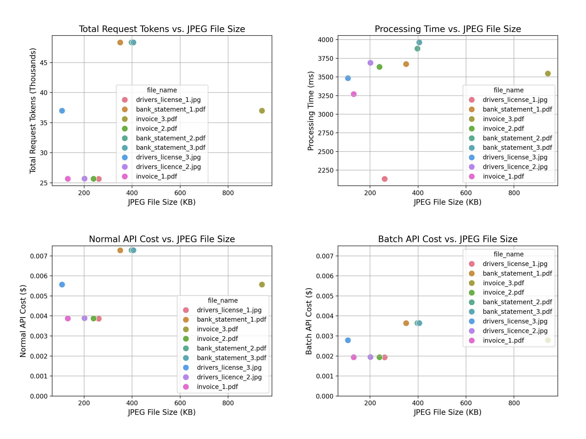

# **Heron File Classifier**

This project provides a Flask-based file classification service, enhanced with OpenAI's GPT-4 capabilities for robust document analysis. The classifier supports various document types, such as PDFs and images (JPEG, PNG, WEBP, GIF), and outputs structured classifications using a Pydantic model.

## **Overview**

At Heron, document processing workflows rely heavily on automated classification for scaling. For this challenge I chose to use OpenAI's GPT-4 to handle poorly named files, scale across industries, and process larger volumes.

Of course maybe the preference would be an in house solution, but there are many off the shelf vision LLMs that could be hosted internally to ensure privacy and security if OpenAI's enterprise guarantees were not sufficient.

### **Key Features**
- **File Format Support**: Handles PDFs, JPEG, PNG, WEBP, and GIF files.
- **AI-Powered Classification**: Utilizes OpenAI's GPT-4 for advanced document analysis.
- **Scalability**: Designed for production readiness with Docker and Gunicorn.
- **Testing**: Tests of GPT-4 code stubbed with `vcrpy` for mocking OpenAI requests, and to provide a quick analysis of costs and performance.

---

## **Setup Instructions**

### **1. Clone the Repository**

```
git clone <repository_url>
cd heron_classifier
```

### **2. Create a Virtual Environment**

```
python -m venv venv
source venv/bin/activate  # Linux/macOS
venv\Scripts\activate     # Windows
```

### **3. Install Dependencies**

```
pip install -r requirements.txt
```

### **4. Set Environment Variables**

Create a `.env` file in the project root:

```
OPENAI_API_KEY=your_openai_api_key
```

### **5. Run the Flask App**

```
python -m src.app
```

The app will be available at `http://127.0.0.1:5000/classify_file`.

### **6. Example API Call**

Using `curl`:

```
curl -X POST -F "file=@files/sample_document.pdf" http://127.0.0.1:5000/classify_file
```

---

## **Testing**

### **Mocking OpenAI Requests with `vcrpy`**

The project uses `vcrpy` to cache API responses from OpenAI, ensuring that the test suite is fast and does not incur costs. Cached requests are stored as YAML files in the `tests/cassettes` directory.

### **Run Tests**

```
pytest tests/
```

---

## **Architecture & Approach**

### **Enhancements**
1. **AI Integration**: Leveraged OpenAI GPT-4 for robust document analysis and classification.
2. **Format Support**: Extended the baseline classifier to process PDFs (by converting to images) and common image formats.  Also used the OpenAI JSON spec to constrain the document classification types.  These can easily be extended as required in different industries and applications.
3. **Production Readiness**:
   - **Dockerization**: Added a `Dockerfile` for containerization.
   - **Gunicorn**: Configured to run as a WSGI server for scalability.
   - **Testing**: Automated tests with caching of API responses.

### **Analysis**
I conducted a cost and performance analysis of OpenAI API usage for different file sizes and types. This was facilitated by the vcrpy cassettes which recorded the http interactions involved for having GPT-4 provide a classification for each of the available test files.

Here are the results for those test files:



The analysis shows a general correlation between file size, processing time and tokens/cost, as we might expect.  The key takeaway is that we get a very robust file type classification from GPT-4 (it correctly classifies every test file provided) that will extend to a range of industries, and costs less than a penny a file, and half that in batch mode.  This is all using OpenAI's fastest and cheapest GPT4 model, the `gpt4o-mini`, which on this simple analysis seems sufficient for the task specified.

### **Why OpenAI GPT-4?**
- **Accuracy**: GPT-4’s ability to understand and classify diverse content ensures robust handling of poorly named or mislabeled files.
- **Flexibility**: Easily scalable to new industries and file types with simple changes to the JSON schema, specified in the Pydantic model in the code.

### **Scalability**
- **Batch API**: The OpenAI Batch API offers significant cost savings for large-scale deployments.


For a further breakdown of productionzation pros and cons see [README_productionization.md](README_productionization.md)

---

## **Production Deployment**

### **Dockerization**
Build and run the app using Docker:

```
docker build -t flask-file-classifier .
docker run -d -p 5000:5000 flask-file-classifier
```

### **CI/CD Integration**
- Use GitHub Actions to automate testing, build, and deployment.
- Ensure API keys are managed securely using environment secrets.

---

## **Future Improvements**

1. **Batch Processing**:
   - Add support for batch uploads to improve throughput for high-volume use cases.
2. **Cost Optimization**:
   - Integrate OpenAI’s cost estimation tools to monitor and manage API usage dynamically.


